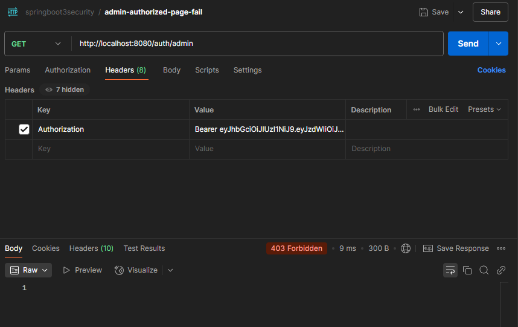

# Spring Boot 3 Security Application

This project is a Spring Boot 3 application that demonstrates the implementation of security features, including user
authentication and authorization using JWT (JSON Web Tokens). It includes a custom user management system and integrates
with Spring Security.  I completed this as a prototype for the fishing-log3 application, which is a web application for
logging fishing trips. The fishing-log3 application is a work in progress, and this project serves as a proof of concept
for the security features that will be implemented in the fishing-log3 application.

## Features

- **User Authentication**: Secure login using JWT.
- **Role-Based Authorization**: Access control based on user roles.
- **Custom UserDetails Implementation**: `UserInfoDetails` class for mapping user data.
- **Password Encoding**: Secure password storage using `PasswordEncoder`.
- **Unit Tests**: Comprehensive test coverage for services and components.

## Technologies Used

- **Java 17**: Core programming language.
- **Spring Boot 3**: Framework for building the application.
- **Spring Security 6**: For authentication and authorization.
- **JWT**: Token-based authentication.
- **Maven**: Build and dependency management tool.
- **JUnit 5**: For unit testing.

## Project Structure

- `src/main/java`: Contains the main application code.
    - `com.springboot3security.entity`: Entity classes for user data.
    - `com.springboot3security.service`: Service classes for business logic.
    - `com.springboot3security.filter`: JWT authentication filter.
    - `com.springboot3security.util`: Utility classes for JWT handling.
- `src/test/java`: Contains unit tests for the application.
- `src/main/resources`: Configuration files (e.g., `application.properties`).

## Configuration

- **application.properties**: Configuration file for database connection, JWT secret key, and other properties.
    - Example file available as `src/main/resources/application.properties.rename`:
    - Rename it to `application.properties` and update the values as needed.
    - Edit the database connection properties:
      ```properties
      spring.datasource.driver-class-name=org.postgresql.Driver
      spring.datasource.url=jdbc:postgresql://localhost:5432/springbootreactjwt
      spring.jpa.properties.hibernate.dialect=org.hibernate.dialect.PostgreSQLDialect
      spring.datasource.username=springbootreactjwt
      spring.datasource.password=<your_password>
      ```
    - Update log file location
      ```properties
      logging.file.path=<your_path_to_log_file> ## the folder you want your log file in
      ```

- To generate a base64 encoded key, you can ask an AI to generate one for you or use the SecretKeyEncoder to generate one
    - To use the SecretKeyEncoder, start with a key value 64 characters long in `jwt.secret` 
      ```properties
      jwt.secret=<your_secret_key_64_characters_long>
      ```
    - Then compile SecretKeyEncoder.java
      ```bash 
      javac src/main/java/com/springboot3security/util/SecretKeyEncoder.java
      ```
    - Run the class with the key value you entered in `jwt.secret` as an argument
      ```bash
      java -cp src/main/java com.springboot3security.util.SecretKeyEncoder
      ```
    - Remove any `=` characters at the end of the output line, these are padding characters, will cause errors, and are not needed. 
      The output line from the SecretKeyEncoder run should be copied to the `jwt.secret` property, replacing the value you just entered.  
      ```properties
      jwt.secret=<your_secret_key_64_characters_long>
      ```

## How to Run

1. Clone the repository:
   ```bash
   git clone https://github.com/wibb1/springboot3security.git
   cd <your-repository-folder>
   ```
2. Build the project using Maven:

    ```bash
    mvn clean install
    ```

3.  Run the application:

    ```bash
    mvn spring-boot:run
    ```

    or run the JAR file:

    ```bash
    java -jar target/spring-boot-3-security-0.0.1-SNAPSHOT.jar
    ```

4. Access the application at http://localhost:8080.

## Endpoints
Use Postman or any other API testing tool to test the endpoints. The application runs on port 8080 by default.

1. Welcome Endpoint:
    - GET /: Returns a welcome message.
    - http://localhost:8080/auth/welcome
    - Response: `Welcome this endpoint is not secure`
    - Status Code: `200 OK`

2. Add New User Endpoint:
    - POST /user: Adds a new user.
    - http://localhost:8080/auth/addNewUser
    - Request Body: JSON object with username, password, and role.
    - Example:
      ```json
      {
        "username": "testuser",
        "password": "Password123",
        "role": "USER"
      }
      ```
    - Response: `User added successfully` OR `User already exists`
    - Status Code: `200 OK`


3. Generate Authentication Token:
    - POST /authenticate: Authenticates a user and generates a JWT.
    - http://localhost:8080/auth/generateToken
    - Request Body: JSON object with username and password.
    - Example:
      ```json
      {
        "username": "testuser",
        "password": "Password123"
      }
      ```
    - Response: JWT token.
    - Status Code: `200 OK`

4. Use jwt.io to decode the token and view the payload
   - Copy the token from the response and paste it into the "Encoded Value" field on jwt.io.
   - Copy the Secret value and paste into the "JWT Signature Verification" field on jwt.io.
   - The payload will show the username (sub) and issue (iat) and expiration (exp) dates.

4. Secure Endpoint for User Role:
    - GET /user: Access restricted to users with the USER role.
    - http://localhost:8080/auth/user
    - Keys: JWT token in the Authorization header. Must be prefixed with "Bearer ".

5. Secure Endpoint for Admin Role:
    - GET /admin: Access restricted to users with the ADMIN role.
    - http://localhost:8080/auth/admin
    - Keys: JWT token in the Authorization header. Must be prefixed with "Bearer ".

7. Secure Endpoint for Admin Role Hit By Authenticated User
    - GET /admin: Access restricted to users with the ADMIN role.
    - http://localhost:8080/auth/admin
    - Keys: JWT token in the Authorization header. Must be prefixed with "Bearer ".
    - Response: `403 Forbidden`

8. Testing
   Run the unit tests using Maven:

    ```bash
    mvn test
    ```

This will execute all the tests in the `src/test/java` directory.